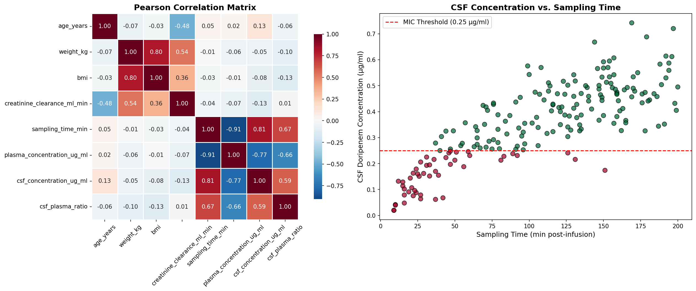
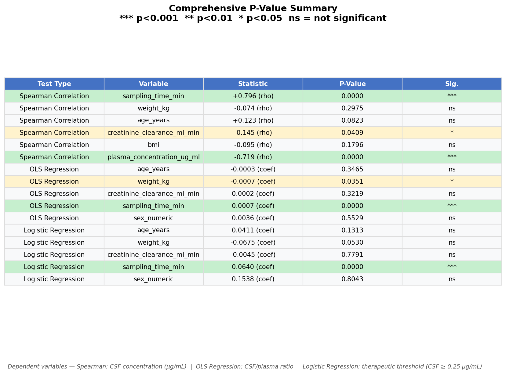
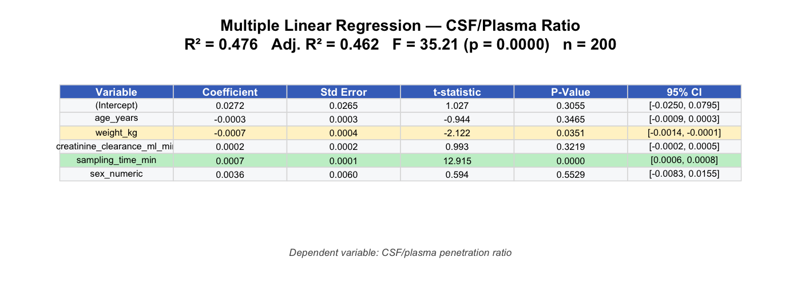
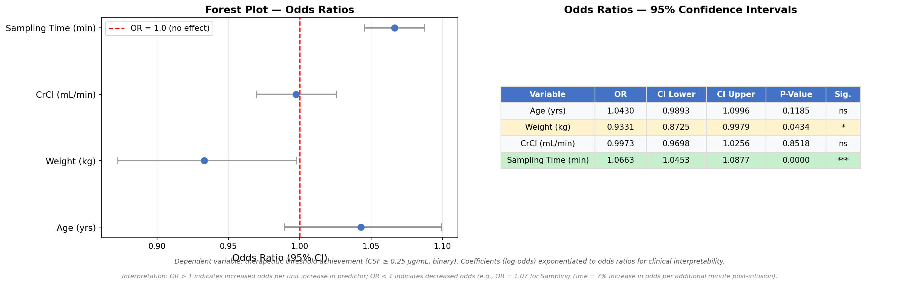
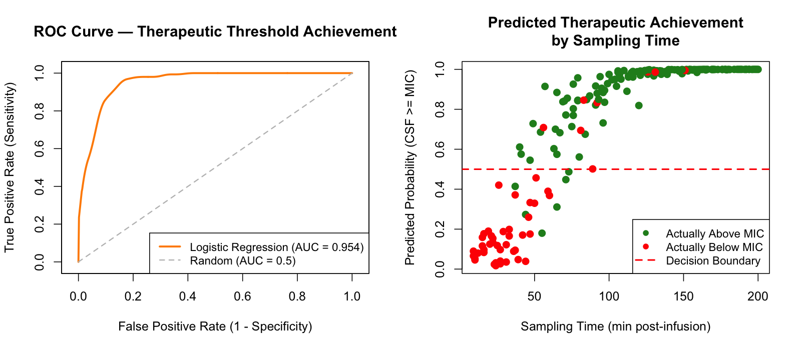

# Doripenem Blood-Brain Barrier Penetration — Statistical Analysis

**Author:** Sartaj Jhooty, 2026

Statistical analysis of doripenem pharmacokinetics across the intact blood-brain barrier (BBB), extending the preliminary findings of Margetis et al. (2011). Implemented in both **Python** and **R**.

## Paper Reference

> Margetis K, Dimaraki E, Charkoftaki G, et al. *Penetration of Intact Blood-Brain Barrier by Doripenem.* Antimicrob Agents Chemother. 2011;55(7):3637-3638.
> https://pmc.ncbi.nlm.nih.gov/articles/PMC3122383/

## Dataset

The original study reported data on 5 neurosurgical patients (Table 1). A synthetic dataset of **n = 200 patients** was generated with pharmacokinetic profiles consistent with the published data, adding clinically relevant covariates (age, sex, BMI, creatinine clearance). The dataset is clearly simulated for analysis demonstration purposes.

**Variables:** patient ID, age, sex, weight, height, BMI, creatinine clearance, infusion duration, sampling time post-infusion, plasma concentration, CSF concentration, CSF/plasma ratio, therapeutic threshold status (CSF >= 0.25 ug/ml).

## Analyses

| Analysis | Description |
|---|---|
| Pearson & Spearman Correlations | Bivariate relationships between PK variables and patient covariates |
| Multiple Linear Regression (OLS) | Predictors of CSF/plasma penetration ratio |
| Logistic Regression | Binary classification — probability of achieving therapeutic CSF concentration (MIC >= 0.25 ug/ml) |
| ROC / AUC | Receiver operating characteristic curve with area under the curve |

## Key Results

**Linear Regression (CSF/Plasma Ratio)**
- Sampling time is the strongest predictor (p < 0.001)
- Weight is significant (p = 0.035)
- Model R-squared = 0.48

**Logistic Regression (Therapeutic Threshold)**
- Sampling time: OR = 1.07, p < 0.001
- Model AUC = 0.954, accuracy = 93%

### Figures

**Figure 1 — Correlation Analysis** — Pearson correlation heatmap and CSF concentration vs. sampling time:


**Figure 2 — Comprehensive P-Value Summary** — All statistical tests and their p-values across Spearman correlations, OLS regression, and logistic regression:


**Figure 3 — OLS Regression Summary** — Coefficients, standard errors, t-statistics, and confidence intervals (R² = 0.48):


**Figure 4 — Odds Ratios with Forest Plot** — Odds ratios with 95% confidence intervals for predictors of therapeutic threshold achievement:


**Figure 5 — ROC Curve & Predicted Probability** — Model discrimination performance and predicted therapeutic achievement by sampling time:


## How to Run

### Prerequisites

**Python 3.8+**
```bash
pip install pandas numpy matplotlib seaborn scipy statsmodels
```

**R 4.0+**
```r
install.packages(c("pROC", "car"))
```

### Generate Data

```bash
python generate_synthetic_data.py
```
This creates `doripenem_bbb_synthetic_data.csv`.

### Run Analysis

**Python:**
```bash
python analysis.py
```

**R:**
```bash
Rscript analysis.R
```

Both produce console output with full statistical results. Figures are split between the two scripts — each figure is generated by only one language (see Output Files table).

## Output Files

| File | Description | Generated by |
|---|---|---|
| `doripenem_bbb_synthetic_data.csv` | Synthetic dataset (n=200) | Python |
| `figure1_correlation_analysis.png` | Pearson heatmap + CSF vs. time scatter | Python |
| `figure2_pvalue_summary.png` | Comprehensive p-value table across all tests | Python |
| `figure3_ols_summary.png` | Full OLS regression summary table | R |
| `figure4_odds_ratios.png` | Odds ratios with forest plot | Python |
| `figure5_logistic_regression.png` | ROC curve + predicted probability plot | R |
